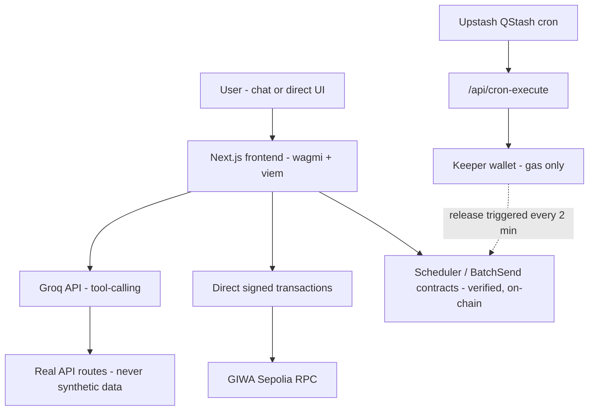

# GIWA Copilot — Technical One-Pager

**A chat-based AI assistant that lets anyone transact on GIWA Sepolia using plain English — no wallet jargon, no raw hex addresses, no manual RPC setup.**

Submitted to: GASOK MVP Build Phase — GIWA Public Testnet
Live demo: `https://giwa-copilot.vercel.app`
Repository: `https://github.com/pawan4293/Giwa-Copilot`

---

## 1. Problem

GIWA's own documentation states its long-term goal is a beginner-friendly interface where users interact on-chain without understanding gas, tokenization, or raw wallet mechanics. That interface doesn't exist yet as a real product — GIWA Copilot is that interface, built now, on real testnet infrastructure.

## 2. Solution

A single chat window that understands natural-language requests — "send 0.01 ETH to alice.up.id," "schedule a payment," "split this bill three ways" — and turns them into real, correctly-formed on-chain transactions that the user reviews and signs themselves. Every number, address, and status shown anywhere in the app is read live from GIWA Sepolia; nothing is simulated or hardcoded.

## 3. What's actually built and tested

| Feature | How it works |
|---|---|
| **Chat with tool-calling** | Groq (`llama-3.3-70b-versatile`, free tier) drives an OpenAI-compatible tool-calling loop against real API routes — never fabricates data |
| **`.up.id` name resolution (both directions)** | Upbit Web3 Names resolved via ENS on Ethereum Sepolia L1; reverse address→name lookup powers Activity and Schedule displays |
| **Verified Address check** | Reads the real on-chain EAS attestation via GIWA's AttestationIndexer contract — a genuine KYC-style check, not a mock |
| **Direct ETH transfers** | User confirms in a modal, signs with their own wallet; live Flashblocks preconfirmation shown (~200ms) before final block confirmation |
| **Trustless recurring payments (Scheduler contract)** | Deployed, verified Solidity contract holds user funds — not the app, not any wallet the team controls. Supports one-time sends with an exact chosen time, and recurring schedules (minute/hour/day/week/month) with a separate first-release delay and repeat interval. Cancel anytime for an instant, exact refund of unpaid ETH. |
| **Automated release via cron sweep** | A single Upstash QStash cron job checks every deployed schedule every 2 minutes and triggers `release()` through a gas-only keeper wallet — the keeper never holds user principal |
| **Bulk Send** | One transaction, multiple recipients, different amounts each, via a verified BatchSend contract |
| **Split / Payment Requests** | Request money owed back from multiple people (equal or custom split), with a shareable link and live paid-status tracking |
| **On-chain Activity feed** | Reads real contract events and Blockscout transaction history — no local database as source of truth |

## 4. Architecture

## 5. Verified Contracts (GIWA Sepolia)

| Contract | Address | Status |
|---|---|---|
| Scheduler | `0xc28787ABf5b0Ba0B6d7714cE496B32D71E846Aff` | ✅ Verified on GIWA Sepolia Explorer |
| BatchSend | `0xcAb18E72C8617AebB8A4C7Cf3670d2A68EC66600` | ✅ Verified on GIWA Sepolia Explorer |

Both contracts' full source, ABI, and bytecode are publicly readable at `sepolia-explorer.giwa.io`.

## 6. Tech stack

- **Frontend:** Next.js (App Router), wagmi, viem, Tailwind, Framer Motion
- **AI:** Groq (free tier, OpenAI-compatible tool-calling)
- **Chain:** GIWA Sepolia (OP Stack, chain ID 91342)
- **Automation:** Upstash QStash (cron sweep pattern)
- **Contracts:** Solidity 0.8.19/0.8.20, deployed via Remix, verified on Blockscout
- **Hosting:** Vercel (free tier)

## 7. Why this stands out

- **Flashblocks integration** — very few submissions will bother wiring up the ~200ms preconfirmation RPC; this app shows it live on every transfer
- **Genuinely non-custodial scheduling** — user funds sit in a verified, audited-by-inspection smart contract, never in the app's or team's control at any point
- **No fake data, anywhere** — every number shown is a live chain read; this was enforced as a hard rule throughout development

## 8. Roadmap (post-grant)

**Phase 2 — Complete the core money-movement toolkit**
- L1→L2 ETH/ERC-20 bridging UI, walking users through GIWA's official bridge (contract already referenced, no UI yet)
- Token/ERC-20 creation flow via chat ("create a token called X")
- Contract safety-check: cross-reference any destination against GIWA Sepolia's verified-contracts data before a send goes through
- KRW-equivalent display via Pyth oracle (address already wired in) for readability only, never as a payment unit

**Phase 3 — Match GIWA's own stated product direction**
- Gasless transactions via account abstraction / paymaster, following GIWA's own roadmap toward a wallet experience where users never need to hold ETH just to pay gas
- GIWA Wallet in-app integration once GIWA's own wallet ships, so Copilot becomes a front-end for it rather than a separate app
- Multi-signature / shared-approval schedules for teams or families managing recurring payments together
- Notification layer (email/Telegram) so users get pinged when a scheduled payment releases or a split gets fully paid, without needing to check the app

**Phase 4 — Developer & ecosystem layer**
- Expose Copilot's tool-calling layer as an API other GIWA dApps can call directly ("GIWA Copilot as infrastructure," not just an end-user app)
- Support for additional GIWA-ecosystem contracts as they launch (new token standards, new verified-address use cases beyond Dojang)
- Security review / audit pass on Scheduler and BatchSend before any mainnet deployment

**Phase 5 — Production readiness**
- Migrate to GIWA mainnet once it's live, with production-grade RPC providers and monitoring (currently on free-tier infra by design, since this is a testnet MVP)
- Move off the QStash free tier to a dedicated always-on keeper infrastructure for reliability at scale

---

*All testnet ETH used in this build has no real monetary value. This is a GIWA Sepolia testnet submission.*